# TechPathway Platform Architecture

This document describes the verified AWS and Kubernetes architecture implemented for the TechPathway enterprise capstone. The Flask application source was supplied for the project; the infrastructure, container deployment, Kubernetes configuration, autoscaling, monitoring, troubleshooting, and cleanup were implemented as the DevOps portion of the capstone.

## Current environment status

The architecture was deployed and validated in `us-east-1`, then intentionally destroyed to stop ongoing AWS charges. The Terraform source, Kubernetes manifests, sanitized evidence, and deployment procedures remain in the repository so the environment can be recreated.

## System context

The platform contains three independently deployable Flask services:

| Service | Repository directory | Responsibility | Container port | Health check |
|---|---|---|---:|---|
| Weekly Call | `weekly-call/` | Customer storefront, administrative dashboard, products, customers, and orders | 5111 | `GET /health` |
| Action Messages | `action-messages/` | Confirmation messages, tracking-number generation, and notification audit log | 5001 | `GET /health` |
| TechPathway Warehouse | `techpathway-warehouse/` | Inventory updates and fulfillment workflow | 5002 | `GET /health` |

The services communicate only through HTTP APIs. They do not share a filesystem or database.

## Canonical architecture

```mermaid
flowchart TB
    user["Browser / API client"]
    awscli["Terraform, AWS CLI,<br/>Docker, kubectl, Helm"]

    subgraph region["AWS Region: us-east-1"]
        ecr["Amazon ECR<br/>3 private repositories"]
        logs["Amazon CloudWatch<br/>EKS control-plane logs"]

        subgraph vpc["VPC: 10.0.0.0/16"]
            subgraph public["Two public subnets"]
                elb["AWS load balancers"]
                nat["NAT Gateway"]
            end

            subgraph private["Two private subnets"]
                subgraph eks["Amazon EKS 1.35"]
                    main["weekly-call<br/>Service :80 → Pod :5111"]
                    notify["action-messages<br/>Service :80 → Pod :5001"]
                    warehouse["techpathway-warehouse<br/>Service :80 → Pod :5002"]
                    metrics["Metrics Server<br/>Prometheus + Grafana"]
                end
            end
        end
    end

    awscli -->|"provision and deploy"| region
    user -->|"HTTP"| elb
    elb --> main
    elb --> notify
    elb --> warehouse
    main -->|"POST /notify/order-confirmed"| notify
    main -->|"POST /warehouse/orders"| warehouse
    ecr -->|"private image pulls"| eks
    eks --> logs
    metrics -.->|"collect metrics"| main
    metrics -.->|"collect metrics"| notify
    metrics -.->|"collect metrics"| warehouse
    eks -->|"outbound traffic"| nat
```



## AWS infrastructure

Terraform defines the AWS infrastructure in `terraform/`.

### Networking

| Component | Implemented configuration |
|---|---|
| VPC | `10.0.0.0/16` |
| Public subnets | `10.0.1.0/24` and `10.0.2.0/24` |
| Private subnets | `10.0.3.0/24` and `10.0.4.0/24` |
| Availability | Subnets distributed across two Availability Zones |
| Internet access | Internet Gateway and public route table |
| Private egress | One NAT Gateway and private route table |
| Workload placement | EKS managed worker nodes in private subnets |

One NAT Gateway was selected as a project cost tradeoff. A production design requiring Availability Zone independence should evaluate one NAT Gateway per Availability Zone.

### Container registry

Three private ECR repositories store the application images:

- `action-messages`
- `techpathway-warehouse`
- `weekly-call`

The verified deployment used the `v1` image tag. Lifecycle policies limit retained images. The committed Kubernetes manifests use the example account ID `123456789012`; a deployment operator replaces it locally with the active account ID and does not commit the real value.

### Amazon EKS

| Setting | Verified value |
|---|---|
| Cluster name | `techpathway-eks-cluster` |
| Kubernetes version | 1.35 |
| Node-group name | `techpathway-capstone-managed-nodes` |
| Instance type | `c7i-flex.large` |
| Desired nodes | 2 |
| Minimum nodes | 2 |
| Maximum nodes | 4 |
| Node placement | Private subnets |

The initial `t3.medium` node group failed because the AWS account rejected that instance type under its Free Tier restrictions. Auto Scaling activity history exposed the EC2 launch failure. Terraform then replaced the failed, tainted node group with `c7i-flex.large`, and two nodes joined the cluster in `Ready` state.

### IAM and logging

- Separate IAM roles are defined for the EKS control plane and managed worker nodes.
- AWS-managed EKS cluster, worker-node, CNI, and ECR pull policies are attached where required.
- An EKS OpenID Connect provider is created for future IAM Roles for Service Accounts integration.
- EKS control-plane logging is sent to a dedicated CloudWatch log group.
- No long-lived AWS credentials are stored in the Terraform or Kubernetes configuration.

## Kubernetes architecture

All application resources are grouped in the `techpathway` namespace.

### Configuration resources

`configmap.yaml` contains non-sensitive settings:

- AWS Region.
- Internal notification and warehouse service URLs.
- Browser-facing notification and warehouse URLs.
- SMTP port, sender name, sender address, and demonstration CC address.

Internal application calls use the Kubernetes Service port:

```text
http://action-messages:80
http://techpathway-warehouse:80
```

`secret.example.yaml` is safe to commit and contains only a placeholder. A deployment operator copies it to the ignored `secret.yaml` file and replaces the placeholder with a securely generated `SECRET_KEY`.

### Deployments

Each service has a dedicated Deployment with:

- Two steady-state replicas after operational and autoscaling tests.
- Rolling-update behavior managed by Kubernetes.
- CPU and memory requests for scheduler placement and HPA calculations.
- CPU and memory limits to constrain container resource consumption.
- Readiness probes against `GET /health`.
- Liveness probes against `GET /health`.
- Configuration loaded from `techpathway-config` and `techpathway-secrets` where required.

The Deployments pull private `v1` images from ECR through the worker-node role.

### Services and public access

Each application uses a Kubernetes `LoadBalancer` Service:

| Service | Service port | Target port |
|---|---:|---:|
| `weekly-call` | 80 | 5111 |
| `action-messages` | 80 | 5001 |
| `techpathway-warehouse` | 80 | 5002 |

This created three public AWS load balancers for capstone validation. A production platform should consolidate routing through an ingress controller or AWS Load Balancer Controller, terminate TLS with AWS Certificate Manager, and use a controlled DNS name.

## Application and data flow

### Order placement

1. A customer places an order in the Weekly Call storefront.
2. Weekly Call stores and automatically confirms the order.
3. Weekly Call sends the order to `POST /warehouse/orders` through the warehouse Kubernetes Service.
4. TechPathway Warehouse decrements inventory and creates a fulfillment item in the `received` state.
5. Weekly Call calls `POST /notify/order-confirmed` through the notification Kubernetes Service.
6. Action Messages creates a tracking number and a notification audit record.
7. When SMTP is not configured, the notification is logged in demonstration mode instead of being sent.

The end-to-end test verified that a storefront order appeared in the warehouse, reduced product inventory, and produced a tracking record in Action Messages.

### Fulfillment states

Warehouse orders move through:

```text
received → picking → packed → shipped
```

The main application can continue an order through its administrative lifecycle after confirmation.

## Scaling and self-healing

### Deployment self-healing

Kubernetes Deployments maintain the desired replica count. During validation, one Weekly Call pod was deleted manually. The ReplicaSet created a replacement, and the new pod reached `1/1 Running` without application redeployment.

### Horizontal Pod Autoscaling

Metrics Server supplies CPU metrics to three Horizontal Pod Autoscalers:

| HPA | CPU target | Minimum pods | Maximum pods |
|---|---:|---:|---:|
| `action-messages-hpa` | 50% | 2 | 5 |
| `techpathway-warehouse-hpa` | 50% | 2 | 5 |
| `weekly-call-hpa` | 50% | 2 | 5 |

Generated traffic increased replicas as high as five. After the load stopped and CPU utilization declined, all three Deployments returned to two replicas.

The EC2 Auto Scaling boundaries of the managed node group and the pod-level HPA limits are independent. This project configured node-group capacity in Terraform but did not deploy Kubernetes Cluster Autoscaler or Karpenter.

## Monitoring architecture

The monitoring layer was installed with Helm:

- Metrics Server chart `3.14.0`, application version `0.9.0`.
- `kube-prometheus-stack` chart `88.5.0`, application version `0.93.1`.
- Prometheus for metrics storage and querying.
- Grafana for cluster, namespace, workload, CPU, memory, and network dashboards.
- kube-state-metrics for Kubernetes object state.
- node-exporter on each worker node for node-level metrics.

Grafana used the chart-provisioned Prometheus data source. Access was provided locally with `kubectl port-forward`, rather than exposing the monitoring interface through a public load balancer.

## Persistence model and availability limitation

The application configuration used local SQLite files for demonstration storage. SQLite files are local to individual containers or pods and are not shared across replicas. Scaling the applications demonstrated Kubernetes scheduling and HPA behavior, but it did not provide shared, highly available application data.

A production implementation should:

- Move shared application state to Amazon RDS or another managed database.
- Define database migrations, backups, restore testing, and retention policies.
- Keep application containers stateless.
- Use persistent storage only where the workload genuinely requires it.

## Security boundaries

### Implemented

- Private ECR repositories.
- Worker nodes in private subnets.
- Separate EKS control-plane and node IAM roles.
- ECR pull-only permission for worker nodes.
- Ignored runtime Secret and safe committed Secret example.
- Ignored `.env`, `.tfvars`, Terraform state, Terraform plans, local databases, and virtual environments.
- Placeholder AWS account ID in committed manifests.
- Grafana accessed through local port forwarding.
- EKS control-plane logs sent to CloudWatch.

### Recommended for production

- HTTPS, ACM certificates, and managed DNS.
- An ingress controller or AWS Load Balancer Controller.
- Kubernetes NetworkPolicies and restricted security groups.
- IAM Roles for Service Accounts for AWS-aware applications.
- External Secrets Operator or AWS Secrets Manager integration.
- Pod security controls and non-root containers where supported.
- Image vulnerability scanning and immutable image digests.
- Centralized application logs, alerts, and incident notification routing.
- PodDisruptionBudgets and topology-aware scheduling.

## Troubleshooting evidence

The project fully demonstrated and recovered one TP-008 failure mode:

### ImagePullBackOff

1. A test Deployment referenced a nonexistent `missing-tag` ECR image.
2. The pod reported `ErrImagePull` and then `ImagePullBackOff`.
3. `kubectl describe pod` showed that the image reference could not be resolved.
4. `kubectl logs` correctly reported that the container had not started.
5. The image was corrected to the valid `v1` tag.
6. The replacement pod reached `1/1 Running`.

CrashLoopBackOff, Pending Pod, incorrect container port, failed readiness probe, and failed liveness probe were listed in the assignment but were not fully demonstrated. They are not presented as completed work in this repository.

## Deployment sequence

The verified high-level deployment order was:

1. Validate AWS identity, region, and service quotas.
2. Initialize, format, validate, plan, and apply Terraform.
3. Configure `kubectl` for the EKS cluster.
4. Authenticate Docker to ECR.
5. Build, tag, and push the three `v1` images.
6. Create the Kubernetes namespace, ConfigMap, and Secret.
7. Deploy the three application Deployments and Services.
8. Validate pods, health endpoints, and the end-to-end order flow.
9. Install Metrics Server and apply the HPAs.
10. Install Prometheus and Grafana with Helm.
11. Validate scaling, self-healing, metrics, and troubleshooting recovery.
12. Delete public Services, application resources, Helm releases, and namespaces.
13. Apply the Terraform destroy plan and verify that the project resources were removed.

## Cleanup verification

Cleanup completed in dependency-aware order:

- Kubernetes LoadBalancer Services were deleted first so AWS could deprovision the external load balancers.
- HPAs, Deployments, test workloads, ConfigMaps, Secrets, and namespaces were removed.
- The Prometheus/Grafana and Metrics Server Helm releases were uninstalled.
- Terraform destroyed 33 managed AWS resources.
- The final Terraform state was empty.
- Follow-up AWS CLI checks found no project EKS cluster, ECR repositories, VPC, or NAT Gateway.

## Future architecture evolution

A stronger production version would add:

1. Amazon RDS for shared transactional data.
2. Amazon SQS or another durable queue for downstream order events.
3. AWS Load Balancer Controller with one HTTPS entry point and path- or host-based routing.
4. Route 53 and ACM for DNS and TLS.
5. Remote encrypted Terraform state with locking.
6. CI/CD or GitOps for image and manifest promotion.
7. EKS add-on lifecycle management and managed observability configuration.
8. NetworkPolicies, IRSA, image scanning, alert routing, and backup validation.
9. Kubernetes Cluster Autoscaler or Karpenter when pod demand can exceed current node capacity.
