# AWS EKS Microservices with Terraform & Kubernetes

Terraform and Kubernetes deployment of a three-service Flask platform on Amazon EKS, with private Amazon ECR repositories, horizontal pod autoscaling, Prometheus, and Grafana.

> **Project scope:** The Flask application source code was supplied for this capstone. My work focused on assessing and containerizing the services, provisioning AWS infrastructure with Terraform, deploying and operating the platform on Kubernetes, implementing autoscaling and monitoring, troubleshooting deployment issues, and safely removing the environment after validation.

## Project objective

The objective was to take three independently deployable Flask services from local execution to a monitored Kubernetes deployment on AWS:

| Service | Purpose | Container port | Health endpoint |
|---|---|---:|---|
| `weekly-call` | Storefront and administrative dashboard | 5111 | `GET /health` |
| `action-messages` | Order-confirmation notifications, tracking numbers, and an audit log | 5001 | `GET /health` |
| `techpathway-warehouse` | Inventory and fulfillment workflow | 5002 | `GET /health` |

An order created in `weekly-call` is automatically confirmed. The main application then calls the warehouse and notification services over HTTP. The warehouse decrements inventory and creates a fulfillment record, while the notification service creates a tracking number and either sends or logs the confirmation message.

## Solution overview

- Built and locally validated three Python 3.11 Docker images.
- Provisioned the AWS networking, IAM, ECR, and EKS resources with Terraform.
- Published versioned images to three private ECR repositories.
- Deployed the services to an EKS managed node group in private subnets.
- Configured Kubernetes Deployments, Services, ConfigMap, Secret, health probes, and resource requests and limits.
- Exposed each application through an AWS load balancer for project validation.
- Configured CPU-based Horizontal Pod Autoscalers with two minimum and five maximum replicas.
- Installed Metrics Server and the Prometheus/Grafana monitoring stack with Helm.
- Demonstrated self-healing, scale-out, scale-in, application metrics, and ImagePullBackOff recovery.
- Destroyed the Kubernetes and AWS resources after testing to stop ongoing cloud charges.

## Architecture

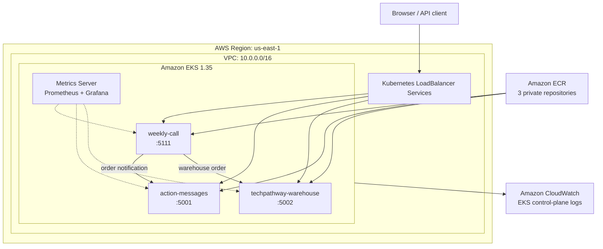

### AWS infrastructure

Terraform manages the following project resources:

- One VPC using `10.0.0.0/16`.
- Two public subnets and two private subnets across two Availability Zones.
- Internet Gateway, public and private route tables, and one NAT Gateway.
- Three private Amazon ECR repositories with lifecycle policies.
- One Amazon EKS cluster running Kubernetes 1.35.
- One managed EKS node group using two `c7i-flex.large` worker nodes by default.
- Node-group scaling boundaries of two minimum, two desired, and four maximum EC2 instances.
- IAM roles and policy attachments for the EKS control plane and worker nodes.
- An EKS OpenID Connect provider and ECR pull permission for the node role.
- Amazon CloudWatch log group for EKS control-plane logging.

The worker nodes run in the private subnets. The NAT Gateway provides controlled outbound connectivity for workloads and node bootstrap operations.

### Kubernetes resources

- Dedicated `techpathway` namespace.
- ConfigMap for non-sensitive service URLs and application configuration.
- An ignored local Secret manifest created from `secret.example.yaml`.
- Three Deployments with CPU and memory requests and limits.
- HTTP readiness and liveness probes using each service's `/health` endpoint.
- Three `LoadBalancer` Services mapping port 80 to ports 5001, 5002, and 5111.
- Three CPU-based Horizontal Pod Autoscalers.
- Metrics Server in `kube-system`.
- Prometheus, Grafana, kube-state-metrics, and node-exporter in `monitoring`.

## Technology stack

| Category | Technologies |
|---|---|
| Infrastructure as code | Terraform, HashiCorp AWS provider |
| Cloud platform | AWS VPC, IAM, EC2, ECR, EKS, CloudWatch |
| Containers | Docker, Amazon ECR |
| Orchestration | Kubernetes, kubectl, Amazon EKS |
| Scaling | Metrics Server, Horizontal Pod Autoscaler |
| Monitoring | Helm, Prometheus, Grafana, kube-state-metrics, node-exporter |
| Applications | Python 3.11, Flask, Gunicorn, SQLite demo storage |
| Local tooling | PowerShell, AWS CLI v2, Git, Visual Studio Code |

## Repository structure

```text
.
|-- action-messages/               # Notification service and Dockerfile
|-- techpathway-warehouse/         # Inventory/fulfillment service and Dockerfile
|-- weekly-call/                    # Storefront/admin service and Dockerfile
|-- terraform/                      # AWS infrastructure as code
|   |-- ecr.tf
|   |-- eks.tf
|   |-- iam.tf
|   |-- networking.tf
|   |-- outputs.tf
|   |-- provider.tf
|   |-- variables.tf
|   |-- versions.tf
|   `-- terraform.tfvars.example
|-- kubernetes/                     # Kubernetes and monitoring manifests
|   |-- namespace.yaml
|   |-- configmap.yaml
|   |-- secret.example.yaml
|   |-- action-messages-deployment.yaml
|   |-- action-messages-service.yaml
|   |-- techpathway-warehouse-deployment.yaml
|   |-- techpathway-warehouse-service.yaml
|   |-- weekly-call-deployment.yaml
|   |-- weekly-call-service.yaml
|   |-- hpa.yaml
|   `-- monitoring-values.yaml
|-- screenshots/                    # Sanitized validation evidence
|-- ARCHITECTURE.md                 # Original application service contract
|-- .gitignore
`-- README.md
```

## Prerequisites

- An AWS account with permission to manage VPC, EC2, IAM, ECR, EKS, and CloudWatch resources.
- AWS CLI v2 configured for the intended account.
- Terraform.
- Docker Desktop.
- `kubectl` compatible with the EKS cluster version.
- Helm.
- Git and PowerShell.

Verify the active AWS identity before creating infrastructure:

```powershell
aws sts get-caller-identity
aws configure get region
```

## Deployment workflow

> Creating an EKS cluster, EC2 nodes, load balancers, and a NAT Gateway incurs AWS charges. Review the Terraform plan before applying it and run the cleanup procedure when the environment is no longer needed.

### 1. Configure and provision AWS infrastructure

```powershell
Set-Location .\terraform
Copy-Item .\terraform.tfvars.example .\terraform.tfvars
```

Review `terraform.tfvars`, then initialize and validate the configuration:

```powershell
terraform init
terraform fmt -check -recursive
terraform validate
terraform plan -out=final.tfplan
terraform apply final.tfplan
```

Configure `kubectl` from the Terraform output:

```powershell
aws eks update-kubeconfig --region us-east-1 --name techpathway-eks-cluster
kubectl get nodes -o wide
```

### 2. Build and publish the service images

Run these commands from the repository root:

```powershell
$AWS_REGION = "us-east-1"
$AWS_ACCOUNT_ID = aws sts get-caller-identity --query Account --output text
$ECR_REGISTRY = "$AWS_ACCOUNT_ID.dkr.ecr.$AWS_REGION.amazonaws.com"

cmd /c "aws ecr get-login-password --region $AWS_REGION | docker login --username AWS --password-stdin $ECR_REGISTRY"

$SERVICES = @("action-messages", "techpathway-warehouse", "weekly-call")

foreach ($SERVICE in $SERVICES) {
    docker build -t "${SERVICE}:v1" ".\$SERVICE"
    docker tag "${SERVICE}:v1" "$ECR_REGISTRY/${SERVICE}:v1"
    docker push "$ECR_REGISTRY/${SERVICE}:v1"
}
```

The committed Deployment manifests intentionally use the example account ID `123456789012`. Before deployment, replace that placeholder in a local working copy with the active AWS account ID. Do not commit the real account ID if the repository will be published.

### 3. Create Kubernetes configuration and deploy the workloads

```powershell
Set-Location .\kubernetes
Copy-Item .\secret.example.yaml .\secret.yaml
```

Replace the placeholder value in `secret.yaml` with a securely generated application secret. The live file is ignored by Git.

Apply the namespace and application configuration first:

```powershell
kubectl apply -f .\namespace.yaml
kubectl apply -f .\configmap.yaml
kubectl apply -f .\secret.yaml
```

Apply the Deployments and Services:

```powershell
kubectl apply -f .\action-messages-deployment.yaml
kubectl apply -f .\techpathway-warehouse-deployment.yaml
kubectl apply -f .\weekly-call-deployment.yaml

kubectl apply -f .\action-messages-service.yaml
kubectl apply -f .\techpathway-warehouse-service.yaml
kubectl apply -f .\weekly-call-service.yaml
```

Verify the rollout and external endpoints:

```powershell
kubectl get deployments,pods -n techpathway
kubectl get services -n techpathway
```

### 4. Install Metrics Server and configure autoscaling

```powershell
helm repo add metrics-server https://kubernetes-sigs.github.io/metrics-server/ --force-update
helm repo update
helm upgrade --install metrics-server metrics-server/metrics-server `
  --version 3.14.0 `
  --namespace kube-system `
  --wait `
  --timeout 5m

kubectl apply -f .\hpa.yaml
kubectl get hpa -n techpathway
```

Each HPA targets 50% average CPU utilization and maintains between two and five replicas.

### 5. Install Prometheus and Grafana

```powershell
helm repo add prometheus-community https://prometheus-community.github.io/helm-charts --force-update
helm repo update
helm upgrade --install monitoring prometheus-community/kube-prometheus-stack `
  --version 88.5.0 `
  --namespace monitoring `
  --create-namespace `
  -f .\monitoring-values.yaml `
  --wait `
  --timeout 15m
```

Verify the monitoring workloads:

```powershell
kubectl get pods -n monitoring
kubectl get deployments,statefulsets,daemonsets -n monitoring
```

Access Grafana locally:

```powershell
kubectl port-forward service/monitoring-grafana -n monitoring 3000:80
```

Open `http://localhost:3000` and use the provisioned Prometheus data source and Kubernetes dashboards.

## Validation results

The deployment was verified through command output and application testing:

| Validation | Observed result |
|---|---|
| Terraform formatting and syntax | `terraform fmt -check -recursive` passed and `terraform validate` returned success |
| EKS connectivity | Two worker nodes reported `Ready` |
| Kubernetes system health | CoreDNS, `kube-proxy`, and VPC CNI pods reported `Running` |
| Application health | All three `/health` endpoints returned successful responses |
| End-to-end order flow | A storefront order reached the warehouse, reduced inventory, and created a notification tracking record |
| Self-healing | A deleted application pod was automatically replaced and returned to `1/1 Running` |
| Manual scaling | Each Deployment was scaled from one to five replicas and then back to two |
| Horizontal autoscaling | Load increased the application replica counts up to five; after load stopped, all returned to two |
| Monitoring | Grafana displayed cluster, namespace, pod CPU, memory, and network metrics from Prometheus |
| Cleanup | Terraform reported `0 added, 0 changed, 33 destroyed`; follow-up AWS queries found no project EKS cluster, ECR repositories, VPC, or NAT Gateway |

## Project evidence

The screenshots below are sanitized project evidence. The EKS environment and its public endpoints were removed after testing, so the images document the validated deployment rather than an environment that is still running.

### Local validation and containerization

| Weekly Call running locally | Three Docker images built |
|---|---|
| 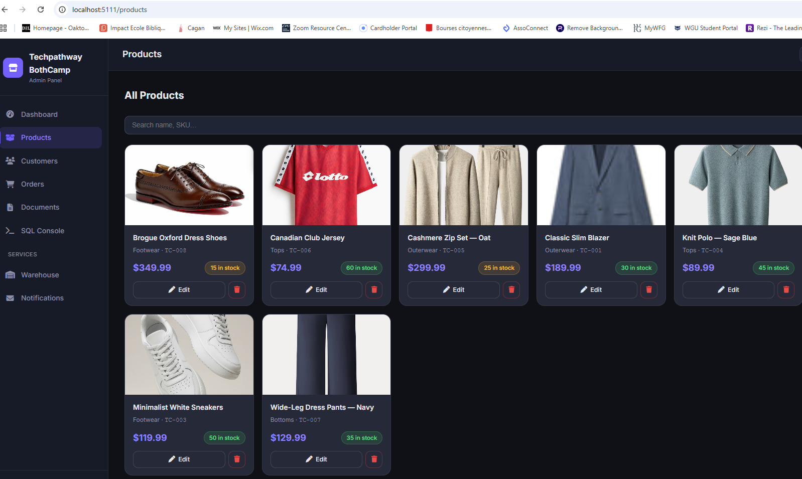 | 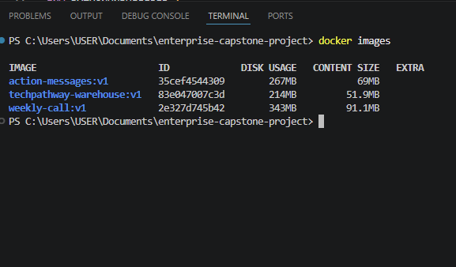 |

### Terraform and Kubernetes deployment

| Terraform formatting and validation | Namespace, ConfigMap, and Secret |
|---|---|
| 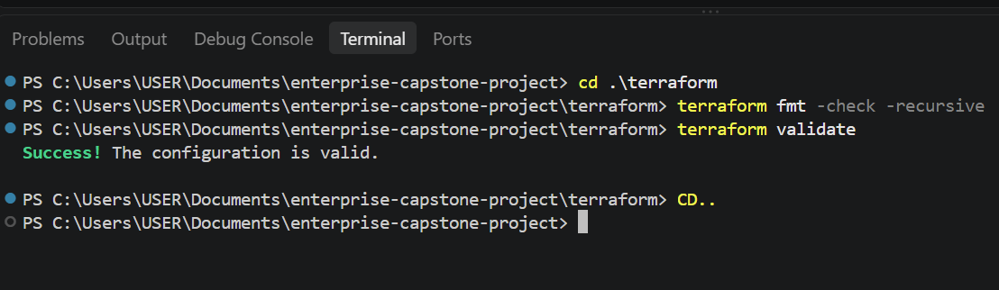 | 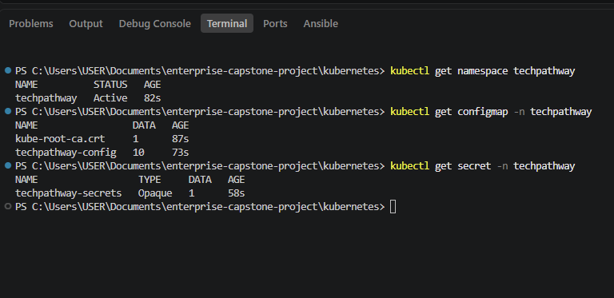 |

| Deployments ready | End-to-end warehouse order |
|---|---|
| 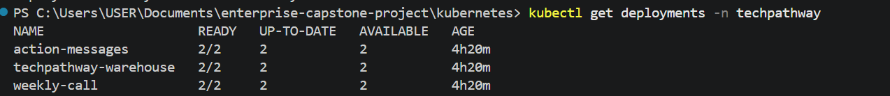 | 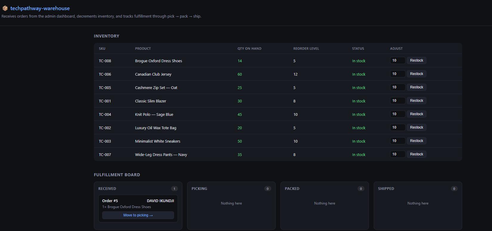 |

### Horizontal Pod Autoscaling

| HPAs configured | Applications scaled out under load |
|---|---|
| 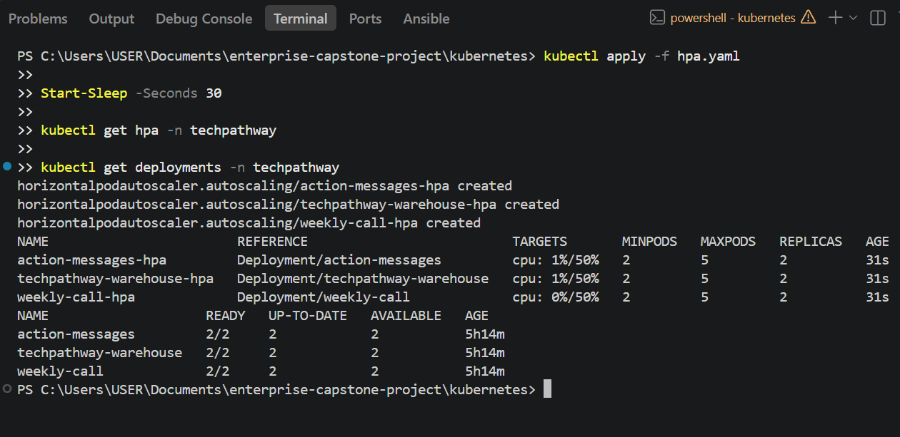 | 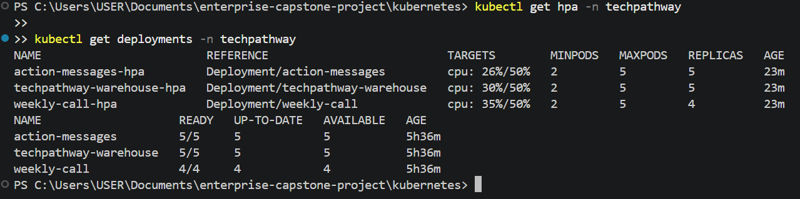 |

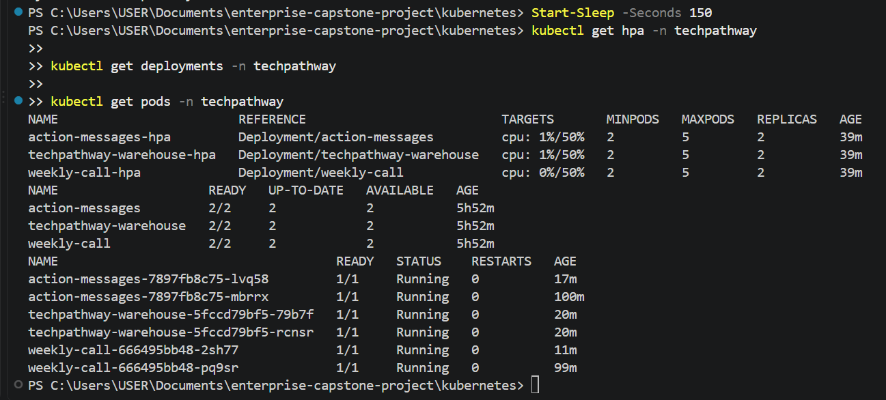

### Prometheus and Grafana monitoring

| Monitoring workloads healthy | Kubernetes cluster dashboard |
|---|---|
| 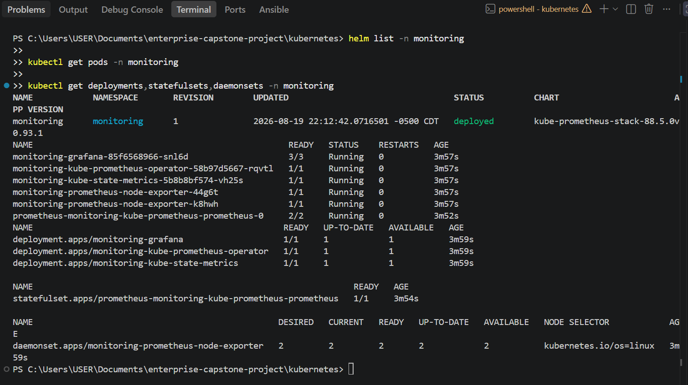 | 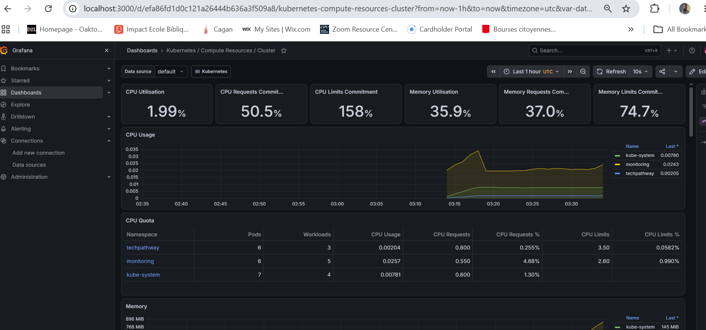 |

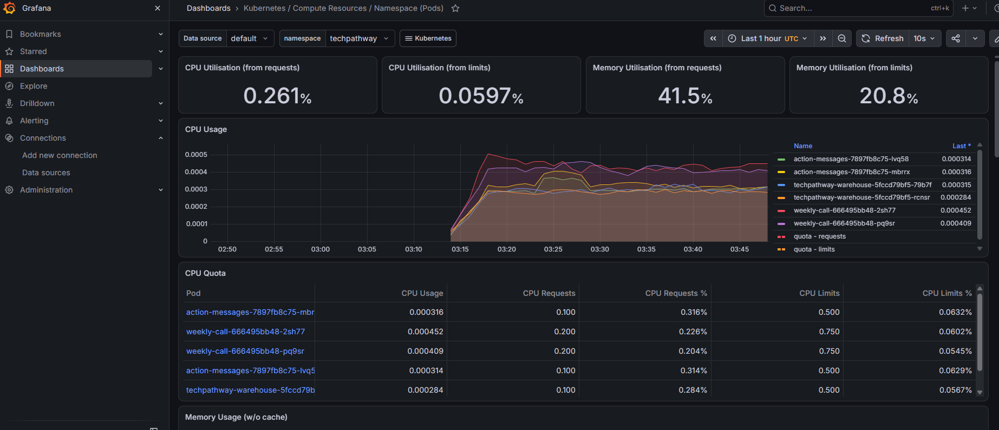

### Troubleshooting and recovery

| ImagePullBackOff reproduced | Workload recovered |
|---|---|
| 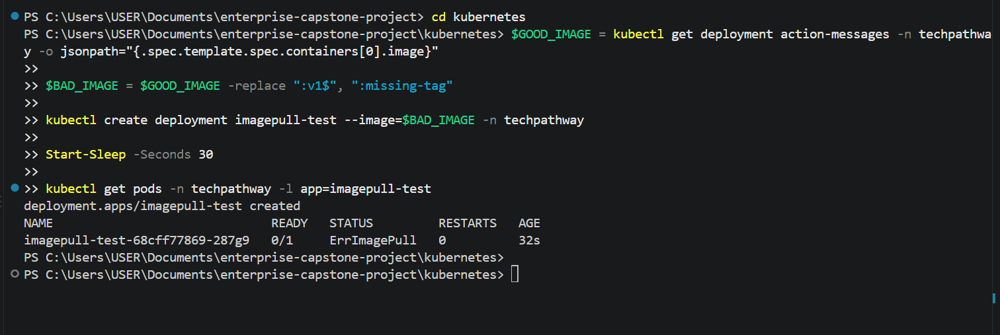 | 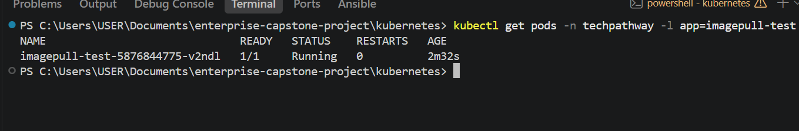 |

### Resource cleanup

| Application resources deleted | Monitoring components removed |
|---|---|
| 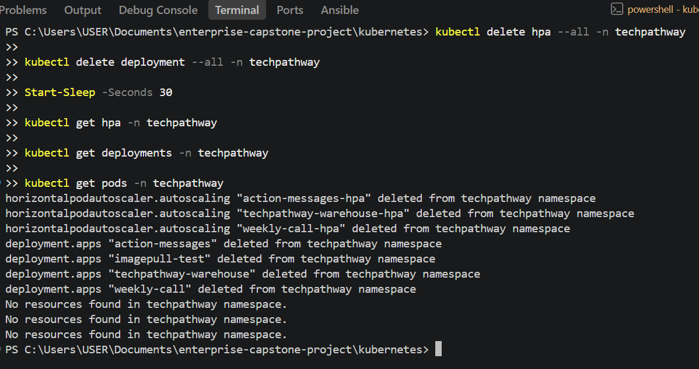 | 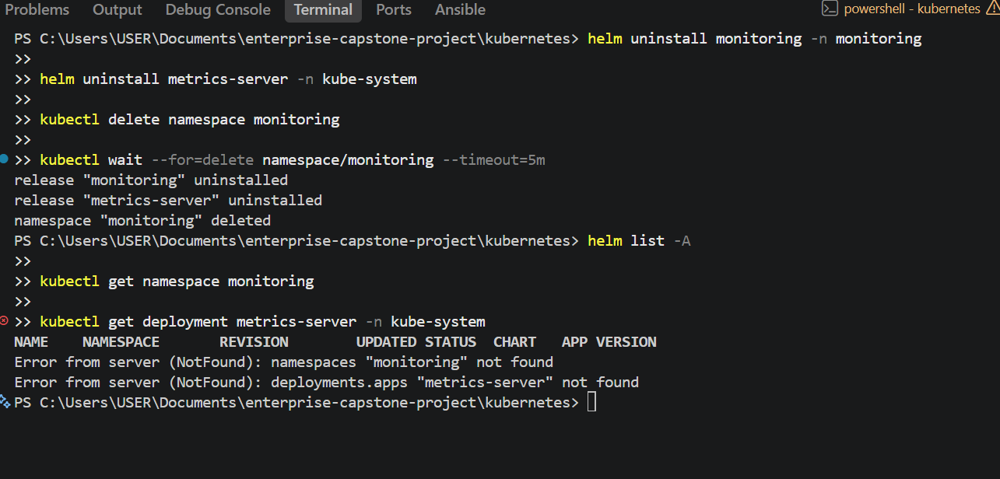 |

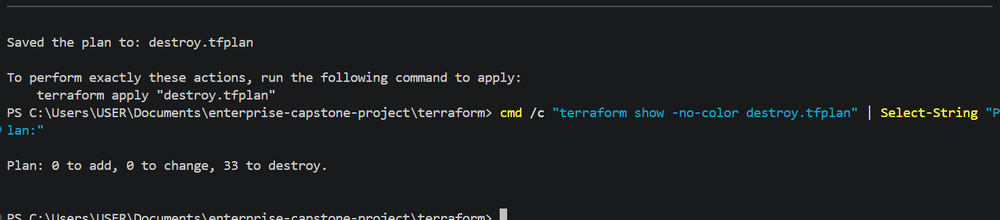

## Troubleshooting performed

### Managed node group could not launch

The first EKS node group remained in `CREATING` and eventually failed because the account rejected `t3.medium` as ineligible under its Free Tier restrictions. Auto Scaling activity history exposed the exact EC2 launch error. The instance type was changed to an available, account-eligible `c7i-flex.large`, Terraform replaced the tainted node group, and two nodes joined the cluster in `Ready` state.

### ECR login failed in PowerShell

The direct AWS CLI-to-Docker pipeline returned an HTTP 400 response in the PowerShell session. Running the same pipe through `cmd /c` preserved the password stream expected by `docker login`, after which authentication succeeded.

### Internal service calls initially used container ports

The main application initially referenced service names with ports 5001 and 5002 even though the Kubernetes Services exposed port 80. Updating the ConfigMap to use `http://action-messages:80` and `http://techpathway-warehouse:80`, followed by a rollout restart, restored end-to-end communication.

### ImagePullBackOff

A test Deployment intentionally referenced the nonexistent image tag `missing-tag`. `kubectl describe pod` showed that ECR could not resolve the tag, and `kubectl logs` correctly reported that the container had never started. Updating the Deployment to the valid `v1` image recovered the workload to `1/1 Running`.

The remaining TP-008 practice scenarios (CrashLoopBackOff, Pending Pod, incorrect container port, failed readiness probe, and failed liveness probe) are not claimed as completed in this repository.

## Security controls

- Application images are stored in private ECR repositories.
- Worker nodes run in private subnets.
- IAM roles separate EKS control-plane and node permissions.
- The node role receives ECR pull-only access for application image retrieval.
- Runtime secrets are excluded from Git; only `secret.example.yaml` is committed.
- Terraform state, plan files, `.terraform/`, `.tfvars`, local databases, `.env` files, and virtual environments are ignored.
- Deployment examples use a placeholder AWS account ID.
- No credentials are baked into the Docker images or Kubernetes examples.

## Monitoring, scaling, resilience, and cost decisions

- Readiness probes keep unready pods out of Service endpoints.
- Liveness probes allow Kubernetes to restart unhealthy containers.
- Deployments recreate deleted pods and use rolling updates.
- HPAs scale each service between two and five replicas at a 50% CPU target.
- Prometheus collects cluster and workload metrics; Grafana provides dashboards.
- kube-state-metrics reports Kubernetes object state, while node-exporter reports node-level metrics.
- One NAT Gateway was used to control project cost rather than deploying one per Availability Zone.
- All cloud resources were destroyed after validation.

## Known limitations and production improvements

- The project uses three public load balancers and plain HTTP. A production design should use an ingress controller or AWS Load Balancer Controller, ACM certificates, HTTPS, and a custom domain.
- The demo configuration uses pod-local SQLite databases. Multiple replicas do not share state; production workloads should use managed shared storage such as Amazon RDS and define a data migration strategy.
- Terraform state is local. Team usage should use an encrypted remote backend with state locking.
- The Kubernetes resources and Helm releases were applied manually. A future version should manage them with Helm, Terraform, GitOps, or a CI/CD pipeline.
- Image tags use `v1`; immutable image digests or unique build tags would provide stronger release traceability.
- NetworkPolicies, PodDisruptionBudgets, IRSA for application workloads, centralized application logs, alert routing, and backup/restore procedures remain future improvements.
- The EKS environment was intentionally destroyed after testing, so the public application endpoints are no longer active.

## Cleanup

Delete the Kubernetes LoadBalancer Services before destroying the VPC so AWS can deprovision their external load balancers:

```powershell
kubectl delete service action-messages techpathway-warehouse weekly-call -n techpathway
kubectl delete hpa --all -n techpathway
kubectl delete deployment --all -n techpathway

helm uninstall monitoring -n monitoring
helm uninstall metrics-server -n kube-system

kubectl delete namespace monitoring
kubectl delete namespace techpathway
```

Then destroy the Terraform-managed infrastructure:

```powershell
Set-Location ..\terraform
terraform plan -destroy -out=destroy.tfplan
terraform apply destroy.tfplan
terraform state list
```

An empty final `terraform state list`, along with `ResourceNotFoundException` responses for the EKS cluster and ECR repositories, confirmed cleanup.

## Lessons learned

- AWS service error messages and Auto Scaling activity history provide the fastest route to the root cause of a failed managed node group.
- Kubernetes Service ports and container ports are distinct and must be reflected correctly in inter-service URLs.
- Health probes, requests, limits, and metrics are prerequisites for reliable scheduling and autoscaling behavior.
- A successful deployment includes validation, recovery testing, observability, and cleanup, not only resource creation.
- Portfolio documentation should distinguish supplied application code from the infrastructure and operational work performed.

## Author

**David Ikundji**<br>
AWS and DevOps portfolio project<br>
[GitHub repository](https://github.com/davidikundji/AWS-EKS-Microservices-with-Terraform-Kubernetes)
