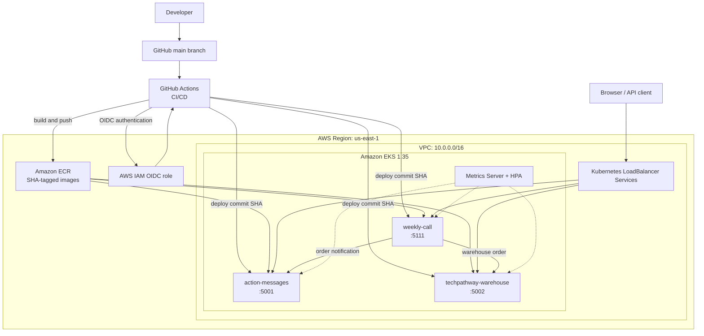

# AWS EKS Microservices with Terraform, Kubernetes & GitHub Actions

Automated deployment of a three-service Flask platform to Amazon EKS using Terraform, Docker, Kubernetes, Amazon ECR, and a secure GitHub Actions CI/CD pipeline.

> **Project scope:** The Flask application source code was supplied for this capstone. My work focused on assessing and containerizing the services, provisioning AWS infrastructure with Terraform, deploying and operating the platform on Kubernetes, implementing autoscaling and monitoring, troubleshooting deployment issues, and automating application delivery with GitHub Actions and AWS OpenID Connect (OIDC).

## Project objective

The objective was to take three independently deployable Flask services from local execution to a monitored Kubernetes deployment on AWS:

| Service | Purpose | Container port | Health endpoint |
|---|---|---:|---|
| `weekly-call` | Storefront and administrative dashboard | 5111 | `GET /health` |
| `action-messages` | Order-confirmation notifications, tracking numbers, and an audit log | 5001 | `GET /health` |
| `techpathway-warehouse` | Inventory and fulfillment workflow | 5002 | `GET /health` |

An order created in `weekly-call` is automatically confirmed. The main application then calls the warehouse and notification services over HTTP. The warehouse decrements inventory and creates a fulfillment record, while the notification service creates a tracking number and either sends or logs the confirmation message.

## Solution overview

- Built and locally validated three Python 3.11 Docker images.
- Provisioned the AWS networking, IAM, ECR, and EKS resources with Terraform.
- Configured the EKS core add-ons and Metrics Server as Terraform-managed resources.
- Created a GitHub Actions CI/CD pipeline that tests, builds, publishes, and deploys all three services.
- Authenticated GitHub Actions to AWS through OIDC without storing long-lived AWS access keys.
- Published immutable, Git commit SHA-tagged images to three private ECR repositories.
- Deployed the services to an EKS managed node group in private subnets.
- Configured Kubernetes Deployments, Services, ConfigMap, Secret, health probes, and resource requests and limits.
- Exposed each application through an AWS load balancer for project validation.
- Configured CPU-based Horizontal Pod Autoscalers with two minimum and five maximum replicas.
- Installed the Prometheus/Grafana monitoring stack with Helm during the initial validation deployment.
- Demonstrated self-healing, scale-out, scale-in, application metrics, and ImagePullBackOff recovery.
- Destroyed the initial environment after testing, then rebuilt it to implement and validate the CI/CD extension.

## Architecture



### AWS infrastructure

Terraform manages the following project resources:

- One VPC using `10.0.0.0/16`.
- Two public subnets and two private subnets across two Availability Zones.
- Internet Gateway, public and private route tables, and one NAT Gateway.
- Three private Amazon ECR repositories with lifecycle policies.
- One Amazon EKS cluster running Kubernetes 1.35.
- One managed EKS node group using two `c7i-flex.large` worker nodes by default.
- Node-group scaling boundaries of two minimum, two desired, and four maximum EC2 instances.
- IAM roles and policy attachments for the EKS control plane and worker nodes.
- Terraform-managed VPC CNI, CoreDNS, `kube-proxy`, and Metrics Server EKS add-ons.
- An EKS OpenID Connect provider and ECR pull permission for the node role.
- A separate GitHub Actions OIDC provider, least-privilege deployment role, and IAM policy.
- An EKS access entry with administrative permissions restricted to the `techpathway` namespace.
- Amazon CloudWatch log group for EKS control-plane logging.

The worker nodes run in the private subnets. The NAT Gateway provides controlled outbound connectivity for workloads and node bootstrap operations.

### Kubernetes resources

- Dedicated `techpathway` namespace.
- ConfigMap for non-sensitive service URLs and application configuration.
- An ignored local Secret manifest created from `secret.example.yaml`.
- Three Deployments with CPU and memory requests and limits.
- HTTP readiness and liveness probes using each service's `/health` endpoint.
- Three `LoadBalancer` Services mapping port 80 to ports 5001, 5002, and 5111.
- Three CPU-based Horizontal Pod Autoscalers.
- Terraform-managed Metrics Server EKS add-on in `kube-system`.
- Prometheus, Grafana, kube-state-metrics, and node-exporter were validated in the initial deployment.

## Technology stack

| Category | Technologies |
|---|---|
| Infrastructure as code | Terraform, HashiCorp AWS provider |
| Cloud platform | AWS VPC, IAM, EC2, ECR, EKS, CloudWatch |
| CI/CD | GitHub Actions, YAML, Git commit SHA image tagging |
| Cloud authentication | GitHub OIDC, AWS STS, IAM roles, EKS access entries |
| Containers | Docker, Amazon ECR |
| Orchestration | Kubernetes, kubectl, Amazon EKS |
| Scaling | Metrics Server, Horizontal Pod Autoscaler |
| Monitoring | Helm, Prometheus, Grafana, kube-state-metrics, node-exporter |
| Applications | Python 3.11, Flask, Gunicorn, SQLite demo storage |
| Local tooling | PowerShell, AWS CLI v2, Git, Visual Studio Code |

## Repository structure

```text
.
|-- .github/
|   `-- workflows/
|       `-- ci-cd.yml              # Test, build, publish, and EKS deployment pipeline
|-- action-messages/               # Notification service and Dockerfile
|-- techpathway-warehouse/         # Inventory/fulfillment service and Dockerfile
|-- weekly-call/                    # Storefront/admin service and Dockerfile
|-- terraform/                      # AWS infrastructure as code
|   |-- ecr.tf
|   |-- eks.tf
|   |-- github-actions.tf           # GitHub OIDC, IAM deployment role, and EKS access
|   |-- iam.tf
|   |-- networking.tf
|   |-- outputs.tf
|   |-- provider.tf
|   |-- variables.tf
|   |-- versions.tf
|   `-- terraform.tfvars.example
|-- kubernetes/                     # Kubernetes and monitoring manifests
|   |-- namespace.yaml
|   |-- configmap.yaml
|   |-- secret.example.yaml
|   |-- action-messages-deployment.yaml
|   |-- action-messages-service.yaml
|   |-- techpathway-warehouse-deployment.yaml
|   |-- techpathway-warehouse-service.yaml
|   |-- weekly-call-deployment.yaml
|   |-- weekly-call-service.yaml
|   |-- hpa.yaml
|   `-- monitoring-values.yaml
|-- screenshots/                    # Sanitized validation evidence
|-- ARCHITECTURE.md                 # Original application service contract
|-- .gitignore
`-- README.md
```

## Prerequisites

- An AWS account with permission to manage VPC, EC2, IAM, ECR, EKS, and CloudWatch resources.
- AWS CLI v2 configured for the intended account.
- Terraform.
- Docker Desktop.
- `kubectl` compatible with the EKS cluster version.
- Helm.
- Git and PowerShell.

Verify the active AWS identity before creating infrastructure:

```powershell
aws sts get-caller-identity
aws configure get region
```

## CI/CD workflow

The workflow in `.github/workflows/ci-cd.yml` runs for pull requests targeting `main`, pushes to `main`, and manual dispatches.

### Continuous integration

The CI job uses a matrix to process the three services independently:

1. Check out the exact Git commit.
2. Build each Docker image.
3. Start the container on its application port.
4. Call its `/health` endpoint and require a successful response.
5. Remove the temporary validation container.

Pull requests run the CI checks without receiving permission to deploy to AWS.

### Continuous delivery

After CI succeeds on `main`, the deployment job:

1. Requests a short-lived GitHub OIDC token.
2. Assumes the Terraform-managed AWS IAM role through AWS STS.
3. Authenticates Docker to Amazon ECR.
4. Builds and pushes all three images with the full Git commit SHA as the immutable tag.
5. Configures `kubectl` for the EKS cluster.
6. Creates or updates the Kubernetes Secret from the encrypted GitHub Actions secret.
7. Renders the Deployment manifests with the real ECR registry and commit SHA without modifying the committed examples.
8. Applies the Kubernetes configuration and waits for all three rolling deployments.
9. Verifies that every Deployment is running the expected commit-tagged image.

If a rollout fails, the workflow captures diagnostics and runs `kubectl rollout undo` for the affected Deployments.

### GitHub configuration

| Type | Name | Purpose |
|---|---|---|
| Repository variable | `AWS_ROLE_ARN` | ARN of the Terraform-managed GitHub Actions deployment role |
| Repository secret | `TECHPATHWAY_SECRET_KEY` | Runtime Flask secret used to create `techpathway-secrets` |

No AWS access key or secret access key is stored in GitHub. The IAM trust policy restricts role assumption to this repository's immutable GitHub owner/repository identity and the `main` branch. The associated EKS access policy is restricted to the `techpathway` namespace.

## Manual deployment workflow

> Creating an EKS cluster, EC2 nodes, load balancers, and a NAT Gateway incurs AWS charges. Review the Terraform plan before applying it and run the cleanup procedure when the environment is no longer needed.

### 1. Configure and provision AWS infrastructure

```powershell
Copy-Item .\terraform\terraform.tfvars.example .\terraform\terraform.tfvars
```

Review `terraform.tfvars`, then initialize and validate the configuration:

```powershell
terraform -chdir=terraform init
terraform -chdir=terraform fmt -check -recursive
terraform -chdir=terraform validate
terraform -chdir=terraform plan -out=".terraform\final.tfplan"
terraform -chdir=terraform apply ".terraform\final.tfplan"
```

Configure `kubectl` from the Terraform output:

```powershell
aws eks update-kubeconfig --region us-east-1 --name techpathway-eks-cluster
kubectl get nodes -o wide
```

### 2. Build and publish the service images

Run these commands from the repository root:

```powershell
$AWS_REGION = "us-east-1"
$AWS_ACCOUNT_ID = aws sts get-caller-identity --query Account --output text
$ECR_REGISTRY = "$AWS_ACCOUNT_ID.dkr.ecr.$AWS_REGION.amazonaws.com"
$IMAGE_TAG = (git rev-parse HEAD).Trim()

cmd /c "aws ecr get-login-password --region $AWS_REGION | docker login --username AWS --password-stdin $ECR_REGISTRY"

$SERVICES = @("action-messages", "techpathway-warehouse", "weekly-call")

foreach ($SERVICE in $SERVICES) {
    docker build -t "${SERVICE}:$IMAGE_TAG" ".\$SERVICE"
    docker tag "${SERVICE}:$IMAGE_TAG" "$ECR_REGISTRY/${SERVICE}:$IMAGE_TAG"
    docker push "$ECR_REGISTRY/${SERVICE}:$IMAGE_TAG"
}
```

The committed Deployment manifests intentionally use the example account ID `123456789012` and example tag `v1`. For a manual deployment, render local copies with the active ECR registry and `$IMAGE_TAG`. Do not commit the real account ID. The CI/CD workflow performs this rendering automatically.

### 3. Create Kubernetes configuration and deploy the workloads

```powershell
Copy-Item .\kubernetes\secret.example.yaml .\kubernetes\secret.yaml
```

Replace the placeholder value in `secret.yaml` with a securely generated application secret. The live file is ignored by Git.

Apply the namespace and application configuration first:

```powershell
kubectl apply -f .\kubernetes\namespace.yaml
kubectl apply -f .\kubernetes\configmap.yaml
kubectl apply -f .\kubernetes\secret.yaml
```

Apply the Deployments and Services:

```powershell
kubectl apply -f .\kubernetes\action-messages-deployment.yaml
kubectl apply -f .\kubernetes\techpathway-warehouse-deployment.yaml
kubectl apply -f .\kubernetes\weekly-call-deployment.yaml

kubectl apply -f .\kubernetes\action-messages-service.yaml
kubectl apply -f .\kubernetes\techpathway-warehouse-service.yaml
kubectl apply -f .\kubernetes\weekly-call-service.yaml
```

Verify the rollout and external endpoints:

```powershell
kubectl get deployments,pods -n techpathway
kubectl get services -n techpathway
```

### 4. Verify Metrics Server and configure autoscaling

```powershell
aws eks describe-addon `
  --region us-east-1 `
  --cluster-name techpathway-eks-cluster `
  --addon-name metrics-server `
  --query "addon.{Status:status,Version:addonVersion,Issues:health.issues}"

kubectl wait `
  --namespace kube-system `
  --for=condition=Available `
  deployment/metrics-server `
  --timeout=5m

kubectl apply -f .\kubernetes\hpa.yaml
kubectl top nodes
kubectl top pods -n techpathway
kubectl get hpa -n techpathway
```

Each HPA targets 50% average CPU utilization and maintains between two and five replicas.

### 5. Install Prometheus and Grafana

```powershell
helm repo add prometheus-community https://prometheus-community.github.io/helm-charts --force-update
helm repo update
helm upgrade --install monitoring prometheus-community/kube-prometheus-stack `
  --version 88.5.0 `
  --namespace monitoring `
  --create-namespace `
  -f .\kubernetes\monitoring-values.yaml `
  --wait `
  --timeout 15m
```

Verify the monitoring workloads:

```powershell
kubectl get pods -n monitoring
kubectl get deployments,statefulsets,daemonsets -n monitoring
```

Access Grafana locally:

```powershell
kubectl port-forward service/monitoring-grafana -n monitoring 3000:80
```

Open `http://localhost:3000` and use the provisioned Prometheus data source and Kubernetes dashboards.

## Validation results

The deployment was verified through command output and application testing:

| Validation | Observed result |
|---|---|
| Terraform formatting and syntax | `terraform fmt`, `terraform validate`, and staged whitespace checks passed |
| Terraform drift | A refreshed plan returned no changes with detailed exit code `0` |
| EKS connectivity | Two worker nodes reported `Ready` |
| Kubernetes system health | CoreDNS, `kube-proxy`, VPC CNI, and Metrics Server reported healthy/available |
| CI/CD execution | Two consecutive GitHub Actions runs completed successfully |
| AWS authentication | GitHub Actions assumed the deployment role through OIDC; no long-lived AWS credentials were stored in GitHub |
| Image traceability | Each ECR repository contained an image tagged with the full triggering Git commit SHA |
| EKS rollout | All three Deployments reached `2/2` Ready and ran images matching the expected commit SHA |
| Application health | All three public load-balancer `/health` endpoints returned HTTP `200` |
| End-to-end order flow | A storefront order reached the warehouse, reduced inventory, and created a notification tracking record |
| Self-healing | A deleted application pod was automatically replaced and returned to `1/1 Running` |
| Manual scaling | Each Deployment was scaled from one to five replicas and then back to two |
| Horizontal autoscaling | A controlled load test raised reported CPU to 354% and scaled `weekly-call` from 2 to 5 replicas; after load removal it returned to 2 |
| Metrics API | `kubectl top` returned node and pod metrics, and each HPA displayed a live CPU value instead of `<unknown>` |
| Monitoring | During the initial deployment, Grafana displayed cluster, namespace, pod CPU, memory, and network metrics from Prometheus |
| Cleanup rehearsal | The initial environment was removed successfully before the CI/CD rebuild; the rebuilt environment remains subject to the cleanup procedure below |

## Project evidence

The screenshots below are sanitized evidence from the initial deployment and operational testing. That environment was removed after validation and later rebuilt to add the GitHub Actions CI/CD pipeline. Load-balancer addresses are intentionally not published because they are temporary environment-specific endpoints.

### Local validation and containerization

| Weekly Call running locally | Three Docker images built |
|---|---|
|  |  |

### Terraform and Kubernetes deployment

| Terraform formatting and validation | Namespace, ConfigMap, and Secret |
|---|---|
|  |  |

| Deployments ready | End-to-end warehouse order |
|---|---|
|  |  |

### Horizontal Pod Autoscaling

| HPAs configured | Applications scaled out under load |
|---|---|
|  |  |


### Prometheus and Grafana monitoring

| Monitoring workloads healthy | Kubernetes cluster dashboard |
|---|---|
|  |  |


### Troubleshooting and recovery

| ImagePullBackOff reproduced | Workload recovered |
|---|---|
|  |  |

### Resource cleanup

| Application resources deleted | Monitoring components removed |
|---|---|
|  |  |


## Troubleshooting performed

### Terraform timed out while polling the managed node group

During the CI/CD rebuild, Terraform reported a local DNS lookup failure while waiting for the EKS managed node group. Direct AWS queries showed that both the cluster and node group had already reached `ACTIVE` with no health issues. After DNS connectivity recovered, the node group was safely untainted in Terraform state and a refreshed plan confirmed that replacement was unnecessary.

### Horizontal Pod Autoscalers displayed unknown metrics

The rebuilt HPAs initially displayed `<unknown>/50%` because the Kubernetes resource metrics API was unavailable. Metrics Server was added as a Terraform-managed EKS community add-on. After it became `ACTIVE`, `kubectl top` returned live metrics and the HPAs successfully scaled under controlled load.

### Managed node group could not launch

The first EKS node group remained in `CREATING` and eventually failed because the account rejected `t3.medium` as ineligible under its Free Tier restrictions. Auto Scaling activity history exposed the exact EC2 launch error. The instance type was changed to an available, account-eligible `c7i-flex.large`, Terraform replaced the tainted node group, and two nodes joined the cluster in `Ready` state.

### ECR login failed in PowerShell

The direct AWS CLI-to-Docker pipeline returned an HTTP 400 response in the PowerShell session. Running the same pipe through `cmd /c` preserved the password stream expected by `docker login`, after which authentication succeeded.

### Internal service calls initially used container ports

The main application initially referenced service names with ports 5001 and 5002 even though the Kubernetes Services exposed port 80. Updating the ConfigMap to use `http://action-messages:80` and `http://techpathway-warehouse:80`, followed by a rollout restart, restored end-to-end communication.

### ImagePullBackOff

A test Deployment intentionally referenced the nonexistent image tag `missing-tag`. `kubectl describe pod` showed that ECR could not resolve the tag, and `kubectl logs` correctly reported that the container had never started. Updating the Deployment to the valid `v1` image recovered the workload to `1/1 Running`.

The remaining TP-008 practice scenarios—CrashLoopBackOff, Pending Pod, incorrect container port, failed readiness probe, and failed liveness probe—are not claimed as completed in this repository.

## Security controls

- Application images are stored in private ECR repositories.
- Worker nodes run in private subnets.
- IAM roles separate EKS control-plane and node permissions.
- The node role receives ECR pull-only access for application image retrieval.
- GitHub Actions uses OIDC and short-lived AWS STS credentials instead of stored AWS access keys.
- The OIDC trust policy is restricted to the repository's immutable GitHub identity and `main` branch.
- The CI/CD IAM policy limits image operations to the three application ECR repositories and cluster discovery to the project EKS cluster.
- The EKS access policy grants the automation role permissions only inside the `techpathway` namespace.
- Runtime secrets are excluded from Git; only `secret.example.yaml` is committed.
- The application secret is stored as an encrypted GitHub Actions secret and materialized as a Kubernetes Secret during deployment.
- Terraform state, plan files, `.terraform/`, `.tfvars`, local databases, `.env` files, and virtual environments are ignored.
- Deployment examples use a placeholder AWS account ID.
- No credentials are baked into the Docker images or Kubernetes examples.

## Monitoring, scaling, resilience, and cost decisions

- Readiness probes keep unready pods out of Service endpoints.
- Liveness probes allow Kubernetes to restart unhealthy containers.
- Deployments recreate deleted pods and use rolling updates.
- HPAs scale each service between two and five replicas at a 50% CPU target.
- Metrics Server provides the live resource metrics required by the HPAs.
- Prometheus, Grafana, kube-state-metrics, and node-exporter were deployed and validated during the initial monitoring phase.
- One NAT Gateway was used to control project cost rather than deploying one per Availability Zone.
- The initial environment was destroyed after validation; the rebuilt environment should also be destroyed when it is no longer required for demonstrations.

## Known limitations and production improvements

- The project uses three public load balancers and plain HTTP. A production design should use an ingress controller or AWS Load Balancer Controller, ACM certificates, HTTPS, and a custom domain.
- The demo configuration uses pod-local SQLite databases. Multiple replicas do not share state; production workloads should use managed shared storage such as Amazon RDS and define a data migration strategy.
- Terraform state is local. Team usage should use an encrypted remote backend with state locking.
- Application delivery is automated, but infrastructure application and the Prometheus/Grafana Helm release remain operator-controlled.
- The current workflow rebuilds and redeploys all services for every push to `main`; path filtering or change detection would avoid unnecessary builds for documentation-only or Terraform-only changes.
- The HPA maintains multiple replicas but does not guarantee that surviving replicas remain on different nodes; topology-spread constraints or pod anti-affinity would improve node-failure resilience.
- Git commit SHA tags provide traceability, but digest-pinned Kubernetes images and image signing would strengthen software-supply-chain controls.
- NetworkPolicies, PodDisruptionBudgets, IRSA for application workloads, centralized application logs, alert routing, and backup/restore procedures remain future improvements.

## Cleanup

Delete the Kubernetes LoadBalancer Services before destroying the VPC so AWS can deprovision their external load balancers:

```powershell
kubectl delete service action-messages techpathway-warehouse weekly-call -n techpathway
kubectl delete hpa --all -n techpathway
kubectl delete deployment --all -n techpathway

helm uninstall monitoring -n monitoring

kubectl delete namespace monitoring
kubectl delete namespace techpathway
```

Metrics Server is managed by Terraform as an EKS add-on and is removed with the cluster. If the Prometheus/Grafana release is not installed, the Helm and `monitoring` namespace commands can be skipped.

Then destroy the Terraform-managed infrastructure:

```powershell
terraform -chdir=terraform plan -destroy -out=".terraform\destroy.tfplan"
terraform -chdir=terraform apply ".terraform\destroy.tfplan"
terraform -chdir=terraform state list
```

This also removes the Terraform-managed GitHub OIDC provider, deployment role, IAM policy, and EKS access resources. An empty final `terraform state list`, along with `ResourceNotFoundException` responses for the EKS cluster and ECR repositories, confirms cleanup.

## Lessons learned

- AWS service error messages and Auto Scaling activity history provide the fastest route to the root cause of a failed managed node group.
- Kubernetes Service ports and container ports are distinct and must be reflected correctly in inter-service URLs.
- Health probes, requests, limits, and metrics are prerequisites for reliable scheduling and autoscaling behavior.
- GitHub OIDC provides secure CI/CD authentication without maintaining long-lived AWS credentials.
- Commit SHA image tags create a direct audit trail from Git source to ECR and the running Kubernetes workload.
- A green pipeline should still be followed by rollout, image identity, endpoint health, metrics, and autoscaling verification.
- A successful deployment includes validation, recovery testing, observability, and cleanup—not only resource creation.
- Portfolio documentation should distinguish supplied application code from the infrastructure and operational work performed.

## Author

**David Ikundji**<br>
AWS and DevOps portfolio project<br>
[GitHub repository](https://github.com/davidikundji/Microservices-App-Deployment-with-Terraform-AWS-EKS)
